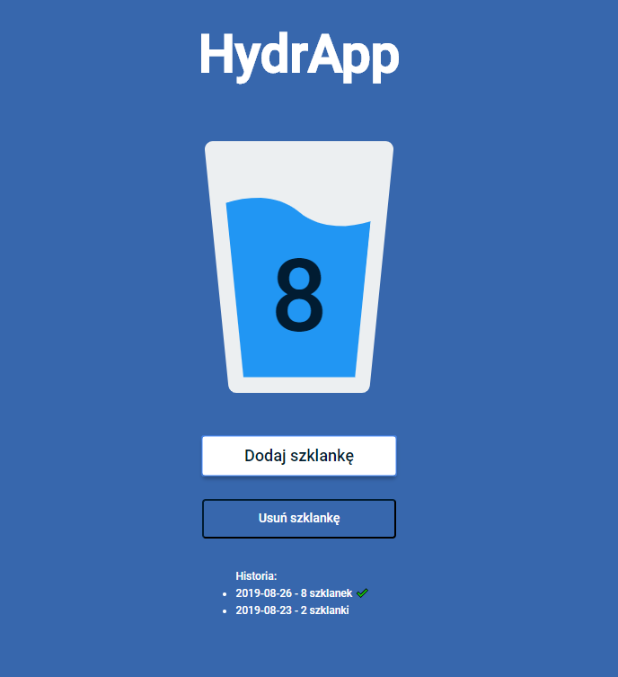

### Hydrapp - with use of PWA

Link to app: [open](https://mc777.github.io/hydrapp/)

### Description:

Application built during WTF - Co Ten Frontend course. The main aim of this project was creating PWA application tracking glasses of water with use of localStorage as a databases.

### Used tools:

- ✔ Visual Studio Code
- ✔ Git
- ✔ Task runner - GULP
- ✔ Running environment - Node.js and NPM

### Screen:

### How to run localy hydrapp localy with gulp-starter

`npm install -g gulp-cli`

`npm install`

`gulp`

To publish your page using github pages use `npm run deploy`
